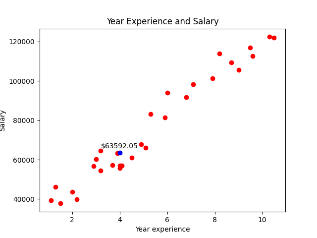
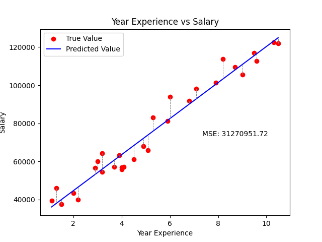

# Salary Prediction - Linear Regression

This project uses **Linear Regression** to predict a person's salary based on their years of experience. It is built using Python and leverages libraries such as `numpy`, `scikit-learn`, and `matplotlib`.

---

## Features

- Predict salary using Linear Regression  
- Calculate MAE (Mean Absolute Error) and MSE (Mean Squared Error)  
- Visualize predictions and prediction errors  
- Simple CLI for interaction

---

## How to Run

### 1. Install required libraries:

```bash
pip install numpy matplotlib scikit-learn
```

### 2. Run the application:

```bash
python main.py
```

### 3. Choose from the menu:

```
Menu:

1 - Visualize prediction  
2 - Visualize MAE  
3 - Visualize MSE  
0 - Exit
```

---

## Example Visualizations

> Predicted salary:



> MSE (Mean Squared Error):



> MAE (Mean Absolute Error):


---

## Requirements

- numpy  
- matplotlib  
- scikit-learn
